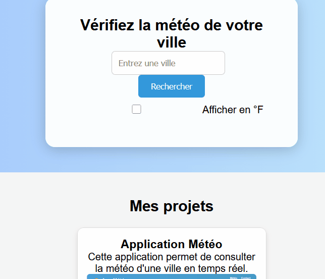

# 🌤️ App Météo Portfolio

Cette application web est un projet personnel destiné à mon portfolio freelance. Elle permet de consulter la météo d'une ville en temps réel, avec un design moderne et interactif.

---

## Fonctionnalités principales

- Recherche de la météo par ville
- Affichage : température, vent, description, icône météo
- Conversion °C / °F via une case à cocher
- Fond dynamique selon la météo (soleil, nuages, pluie, neige, etc.)
- Design responsive pour mobile, tablette et desktop
- Header et footer professionnels

---

## Capture d’écran




> *Pour un GIF animé, remplacer l'image par un fichier GIF montrant la météo en action.*

---

## Technologies utilisées

- HTML5
- CSS3 (animations et responsive design)
- JavaScript (fetch API)
- OpenWeatherMap API

---

## Comment utiliser

1. Cloner le dépôt ou télécharger les fichiers
2. Ouvrir `index.html` dans votre navigateur
3. Entrer le nom d'une ville et cliquer sur "Rechercher"
4. Cocher la case pour afficher la température en °F si souhaité

---

## API

L'application utilise l'API [OpenWeatherMap](https://openweathermap.org/) pour récupérer les données météo.  
N'oubliez pas de remplacer la clé API dans `script.js` :

```js
const apiKey = "VOTRE_CLE_API_ICI";
